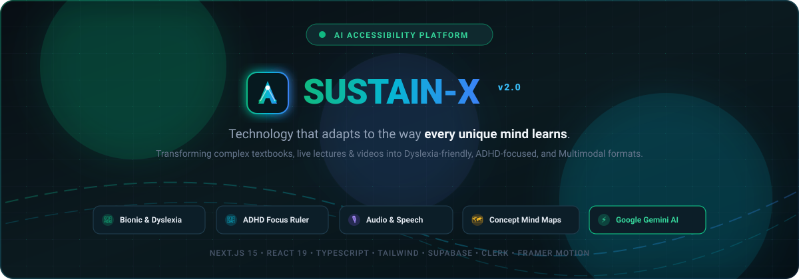

  <!-- Animated Typing SVG Header -->
  

    

  

    
    
    
  

---

### 💫 About Me

- 🚀 Passionate **Full-Stack & AI Engineer** focused on building high-impact, accessible software.
- 🧠 Creator of **[Sustain-X](https://github.com/skandakn/Sustain-X-)** — An AI-powered adaptive accessibility platform for neurodivergent and multimodal learners.
- 🛠️ Specializing in **Next.js 15, React 19, TypeScript, Groq LPU / LLMs, and Supabase**.
- 🌱 Constantly exploring **neurosymbolic AI, multimodal vision models, and human-computer accessibility (WCAG 2.1 AAA)**.

---

### 🌟 Featured Project: [Sustain-X](https://github.com/skandakn/Sustain-X-)

  
   
  

    <b>Sustain-X</b> transforms educational content in real-time with Bionic Reading, ADHD focus rulers, live lecture transcription, dynamic concept mindmaps, and Socratic AI tutoring.
  

  <a href="https://github.com/skandakn/Sustain-X-"><b>Explore the Repository ➔</b></a>

---

### 🛠️ Tech Stack & Toolkit

| Category | Technologies & Tools |
| :--- | :--- |
| **Frontend & UI** |      |
| **Backend & Cloud** |      |
| **AI & Multimodal** |     |
| **DevOps & Tools** |     |

---

### 📊 GitHub Activity & Analytics

  
  

 

  

---

  ⭐ If you find any of my repositories interesting, feel free to star them! Always open to collaborating on innovative AI & accessibility projects.

