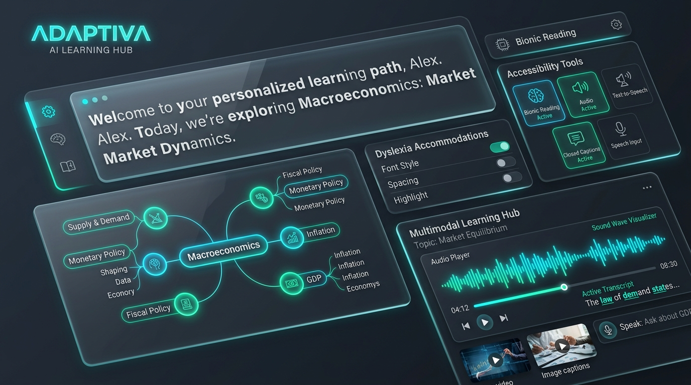
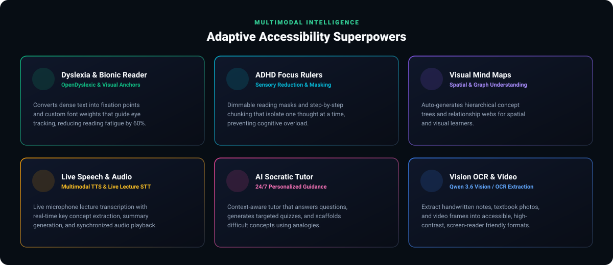
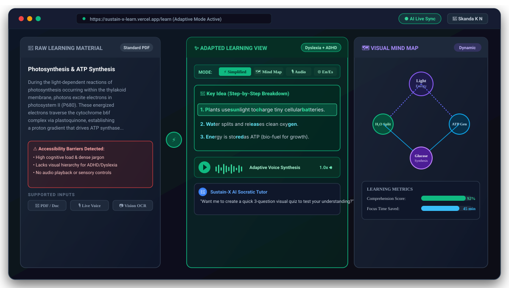
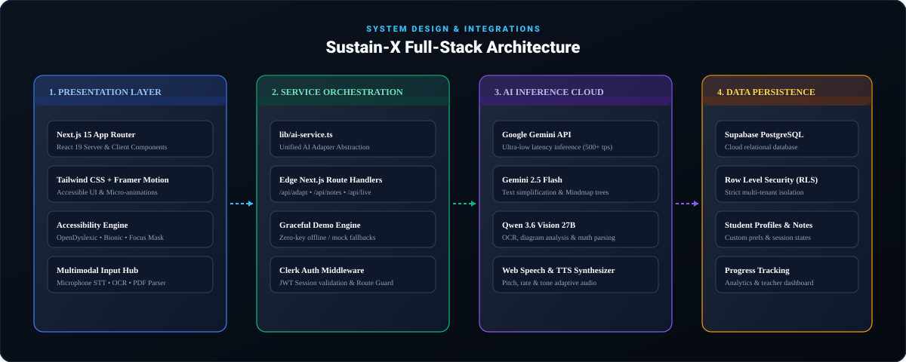
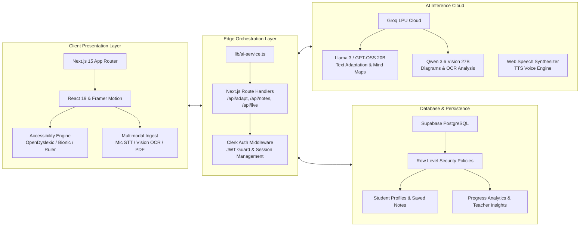

<div align="center">

  <!-- Main Animated Hero Banner -->
  

  <br/><br/>

  <!-- Shields Badges Row 1: Frameworks & AI -->
  <a href="https://nextjs.org/"></a>
  <a href="https://react.dev/"></a>
  <a href="https://www.typescriptlang.org/"></a>
  <a href="https://tailwindcss.com/"></a>
  <a href="https://groq.com/"></a>
  <a href="https://supabase.com/"></a>
  <a href="https://clerk.com/"></a>

  <br/>

  <!-- Shields Badges Row 2: Status & Compliance -->
  
  
  
  
  

  <br/><br/>

  <h3>🌟 <i>Technology that adapts to the way every unique mind learns.</i> 🌟</h3>

  <p align="center">
    <b>Sustain-X</b> is a next-generation AI-powered adaptive accessibility platform that dynamically transforms complex educational material in real-time according to individual cognitive, visual, auditory, and neurodivergent profiles.
  </p>

  <p align="center">
    <a href="#-quick-start"><b>⚡ Get Started</b></a> •
    <a href="#-key-features"><b>✨ Features</b></a> •
    <a href="#-interactive-ui-showcase"><b>🖥️ UI Showcase</b></a> •
    <a href="#-system-architecture"><b>🏗️ Architecture</b></a> •
    <a href="#-application-routes"><b>🧭 Routes</b></a> •
    <a href="#-api-reference"><b>🔌 API Reference</b></a> •
    <a href="#-accessibility--standards"><b>♿ WCAG Standards</b></a>
  </p>

</div>

<p align="center">
  
</p>

<!-- 3D UI Showcase Mockup -->
<div align="center">
  
</div>

<p align="center">
  
</p>

## 💡 The Problem & The Sustain-X Solution

Traditional learning management systems force every student into a monolithic, rigid textbook format. For the **1 in 5 learners** with dyslexia, ADHD, cognitive differences, or sensory impairments, dense text walls cause severe fatigue, distraction, and exclusion.

| Traditional Learning Platforms ❌ | Sustain-X Adaptive Experience ✨ |
| :--- | :--- |
| 🔴 **Dense, uniform text blocks** with no visual anchors | 🟢 **Bionic Reading & Dyslexia Typography** with weighted fixation points |
| 🔴 **High sensory distractions** & cognitive overload | 🟢 **ADHD Focus Rulers** & customizable sensory reduction masks |
| 🔴 **Text-only explanations** requiring heavy memorization | 🟢 **Instant Concept Mind Maps** & interactive hierarchical visual graphs |
| 🔴 **Static lectures** with delayed or missing notes | 🟢 **Live Microphone Transcription** & real-time automated AI note synthesis |
| 🔴 **Generic one-size-fits-all tests** | 🟢 **Socratic AI Tutor** that generates custom step-by-step analogies & quizzes |

<p align="center">
  
</p>

## ✨ Key Features

<div align="center">
  
</div>

### 1. 📖 Dyslexia & Bionic Reading Engine
- **Saccadic Fixation Anchors**: Automatically highlights the initial letters of each word to guide eye flow and eliminate ocular skipping.
- **OpenDyslexic Typeface**: Weighted bottom lettering prevents letter flipping (`b` vs `d`, `p` vs `q`).
- **Custom Kerning & Contrast**: Adjust letter spacing, word gaps, line heights, and background tints (Sepia, Charcoal, High-Contrast Solar).

### 2. 🎯 ADHD Sensory Focus Ruler
- **Focused Reading Window**: Dims surrounding paragraphs and illuminates only the current sentence or thought unit.
- **Cognitive Step Chunking**: Deconstructs multi-clause academic paragraphs into sequential, digestible bullet points.
- **Sensory De-clutter Mode**: Strips unnecessary sidebars, ads, and background animations with a single toggle.

### 3. 🗺️ Dynamic Visual Concept Mind Maps
- **Automated Concept Extraction**: AI parses complex topics into interactive visual knowledge trees.
- **Spatial Relationship Graph**: Visualizes cause-and-effect, sub-topics, and definitions for spatial and visual thinkers.
- **Downloadable & Interactive**: Zoom, pan, and expand mind-map nodes on the fly.

### 4. 🎙️ Live Lecture Transcription & Multimodal Audio
- **Real-Time Speech-to-Text**: Stream live classroom or lecture audio with instant transcription.
- **Synchronized Audio Playback (TTS)**: Listen to learning materials with adjustable speed, pitch, and voice synthesis.
- **Automated Key Takeaways**: Generates live meeting summaries and study cheat-sheets during the lecture.

### 5. 🤖 Context-Aware Socratic AI Tutor
- **Step-by-Step Analogies**: Explains difficult concepts using relatable metaphors tailored to student interests.
- **Interactive Concept Checks**: Generates customized 3-question mini-quizzes to reinforce active recall.
- **Multilingual Translation**: Seamlessly translates study materials and explanations into Spanish, French, German, and more.

### 6. 👁️ Vision OCR & Multimodal Ingestion
- **Document & Image Parsing**: Upload textbook photos, whiteboard sketches, or PDF slides for instant extraction via Qwen Vision / OCR.
- **Clean Structure Re-formatting**: Converts noisy scans into clean, screen-reader friendly markdown with proper heading hierarchies.

<p align="center">
  
</p>

## 🖥️ Interactive UI Showcase

<div align="center">
  
</div>

<p align="center">
  <i>The 3-panel Sustain-X Workspace: Original Dense Document ➔ Real-time AI Transformation Engine ➔ Multimodal Dyslexia/ADHD Accommodations &amp; Concept Mind Map.</i>
</p>

<p align="center">
  
</p>

## 🏗️ System Architecture

<div align="center">
  
</div>



<p align="center">
  
</p>

## 🚀 Quick Start

### 📋 Prerequisites
- **Node.js** (v18.18.0 or later)
- **npm**, **pnpm**, or **yarn**
- Modern Web Browser (Chrome, Edge, Firefox, Safari)

### 1️⃣ Clone & Install

```bash
# Clone the repository
git clone https://github.com/skandakn/Sustain-X-.git

# Navigate into the project directory
cd Sustain-X-

# Install dependencies
npm install
# or
pnpm install
```

### 2️⃣ Configure Environment Variables

Copy `.env.example` to `.env.local`:

```bash
cp .env.example .env.local
```

Fill in your configuration details in `.env.local`:

```env
# Supabase Configuration (Optional for Demo Mode)
NEXT_PUBLIC_SUPABASE_URL=your_supabase_project_url
NEXT_PUBLIC_SUPABASE_ANON_KEY=your_supabase_anon_key
NEXT_PUBLIC_SUSTAIN_X_DEMO_MODE=true

# AI Provider & Inference Models (Groq Cloud)
AI_PROVIDER=groq
AI_MODEL=openai/gpt-oss-20b
AI_VISION_MODEL=qwen/qwen3.6-27b
GROQ_API_KEY=your_groq_api_key_here

# Clerk Authentication (Optional)
NEXT_PUBLIC_CLERK_PUBLISHABLE_KEY=your_clerk_publishable_key
CLERK_SECRET_KEY=your_clerk_secret_key
```

> [!NOTE]
> **Zero-Key Hackathon Demo Mode**: If `GROQ_API_KEY` or `SUPABASE` keys are not provided, Sustain-X gracefully falls back to built-in simulated data and local offline storage so you can test the full user journey seamlessly!

### 3️⃣ Launch the Development Server

```bash
npm run dev
# or
pnpm dev
```

Open **[http://localhost:3000](http://localhost:3000)** in your browser to experience Sustain-X!

<p align="center">
  
</p>

## 🧭 Application Routes

| Route | Page Name | Description | Key Modalities |
| :--- | :--- | :--- | :--- |
| `/` | **Landing Page** | Platform overview, interactive feature cards & demo entry | Hero, Feature Grid, Testimonials |
| `/onboarding` | **Accessibility Profile** | Personalized survey to configure learning preferences | Dyslexia, ADHD, Sensory calibration |
| `/dashboard` | **Student Hub** | Active courses, saved notes, and quick action cards | Recent materials, progress metrics |
| `/learn` | **Adaptive Workspace** | Core dual-panel learning and content transformation | Bionic reader, mindmap, TTS, quiz |
| `/live` | **Live Lecture Mode** | Microphone speech-to-text with auto key point extraction | Real-time STT, audio waveform, summary |
| `/video` | **Video Accessibility** | Video lecture processing with synchronized transcript | Video player, caption highlighter |
| `/tutor` | **AI Socratic Tutor** | Conversational AI companion for concept breakdown | Chat UI, analogy generator, knowledge checks |
| `/settings` | **Accessibility Controls** | Comprehensive visual, font, and sensory toggles | Contrast, OpenDyslexic font scale, Ruler |
| `/progress` | **Learning Analytics** | Visual charts of retention, focus time, and completions | Recharts visual analytics |
| `/teacher` | **Educator Dashboard** | Classroom accessibility insights and accommodation tracking | Student needs breakdown, class trends |
| `/architecture` | **System Architecture** | Interactive node diagram of the platform stack | Mermaid live graph, schema viewer |
| `/about` | **Mission & Problem** | Deep dive into the educational accessibility gap | Case studies, WCAG documentation |

<p align="center">
  
</p>

## 🔌 API Service Abstraction

Sustain-X unifies all multimodal transformations inside `lib/ai-service.ts`. Available service methods include:

```typescript
// AI Service Abstraction Layer
import { aiService } from '@/lib/ai-service';

// 1. Simplify complex reading material
const simplified = await aiService.simplifyText(rawContent, userProfile);

// 2. Generate structured hierarchical Mind Maps
const mindmapData = await aiService.generateMindMap(content);

// 3. Deconstruct dense topics into step-by-step logic
const steps = await aiService.explainStepByStep(concept);

// 4. Generate targeted active recall quizzes
const quiz = await aiService.generateQuiz(content, { count: 3, difficulty: 'medium' });

// 5. Multi-language translation
const translated = await aiService.translateContent(content, 'es');

// 6. Automatic neurodivergent accessibility needs analysis
const needsProfile = await aiService.analyzeAccessibilityNeeds(userResponses);
```

<p align="center">
  
</p>

## ♿ Accessibility & Standards Compliance

Sustain-X is engineered from the ground up to comply with **WCAG 2.1 Level AAA** guidelines:

- ✅ **Perceivable**: High-contrast color modes (minimum 7:1 ratio), alternative text for visual assets, customizable font scaling.
- ✅ **Operable**: Full keyboard accessibility (`Tab`, `Shift+Tab`, `Space`, `Enter`), no flashing content (>3 Hz threshold), skip navigation links.
- ✅ **Understandable**: Predictable UI structures, OpenDyslexic font support, bionic fixation points, step-by-step simplification.
- ✅ **Robust**: Clean semantic HTML5 elements, ARIA live regions for speech-to-text, tested across all major screen readers.

<p align="center">
  
</p>

## 🛠️ Database Schema

When connecting your Supabase project, execute the migration located at:
`supabase/migrations/20260821173000_initial_sustain_x_schema.sql`

This initializes:
- `profiles`: User account details and learning personas
- `accessibility_preferences`: Dyslexia, ADHD, font sizes, contrast, and audio settings
- `learning_materials`: Stored raw and transformed educational texts
- `learning_sessions`: Timers, focus metrics, and active modalities
- `saved_notes`: AI-generated summaries and personalized student annotations
- `progress`: Module completion scores and retention metrics
- `Row Level Security (RLS)`: Multi-tenant protection ensuring zero unauthorized data access

<p align="center">
  
</p>

## 🤝 Contributing

Contributions, feedback, and feature requests are warmly welcomed!

1. Fork the Project (`https://github.com/skandakn/Sustain-X-/fork`)
2. Create your Feature Branch (`git checkout -b feature/AmazingFeature`)
3. Commit your Changes (`git commit -m 'feat: Add AmazingFeature'`)
4. Push to the Branch (`git push origin feature/AmazingFeature`)
5. Open a Pull Request

<p align="center">
  
</p>

## 👨‍💻 Creator & Connect

<div align="center">

  **Created with 💚 by [Skanda K N](https://github.com/skandakn)**

  <a href="https://github.com/skandakn"></a>
  <a href="https://github.com/skandakn/Sustain-X-/stargazers"></a>
  <a href="https://github.com/skandakn/Sustain-X-/issues"></a>

</div>

<p align="center">
  
</p>

## 📄 License

Distributed under the **MIT License**. See [`LICENSE`](LICENSE) for more information.

<div align="center">
  <sub>Built for human accessibility, neurodiversity, and the future of inclusive learning.</sub>
</div>
